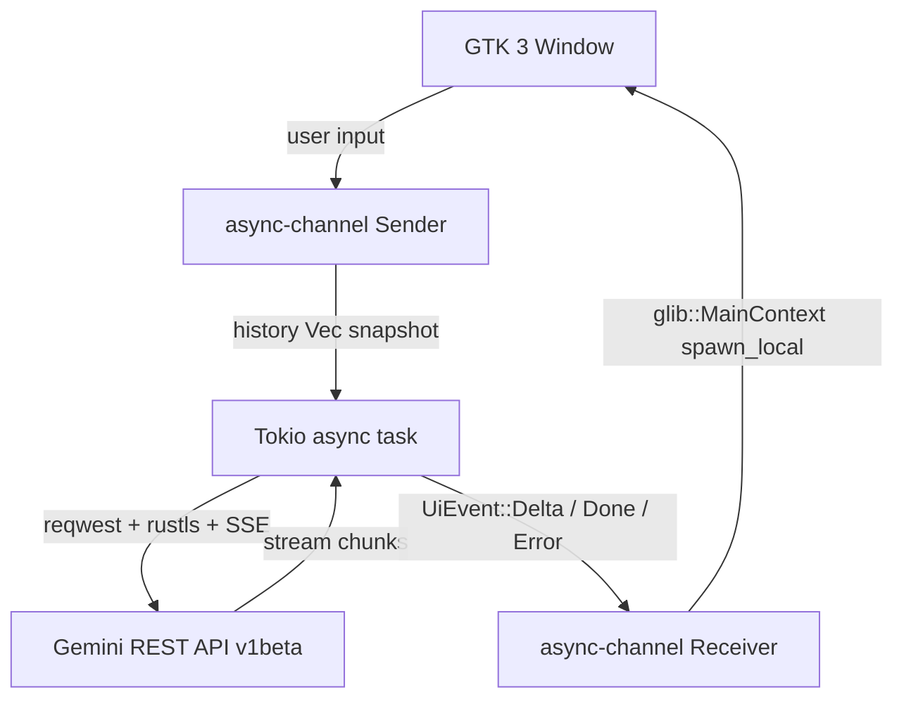

# Gemini Lite
> A lightweight, native Linux client for Google Gemini. No Electron, no WebKit, just Rust.

[](https://github.com/Tormknd/gemini-lite/actions)


[](LICENSE)


Gemini Lite started from a simple frustration: asking text questions should not require a full browser engine and hundreds of MB of RAM. This app is a native GTK client in Rust that talks directly to the Gemini API.

---

## The Philosophy

Modern desktop software often accepts avoidable overhead as "normal". This project does not.

- **Efficiency by design:** native GTK 3 UI + Rust runtime, no embedded Chromium.
- **API-first architecture:** the app calls Gemini REST directly instead of wrapping `gemini.google.com`.
- **Pragmatic security:** API key in Secret Service (GNOME Keyring) when available, with a restricted file fallback.

Historical note: an early WebKitGTK wrapper worked locally but failed reliably behind Google's WAF due to TLS/client fingerprint differences. Switching to the official API removed that class of failures and simplified the stack.

---

## Benchmarks (Typical)

These numbers are measured on a local Linux workstation and should be treated as indicative, not absolute.

| Metric | Chrome + Gemini tab | Gemini Lite |
| :--- | :--- | :--- |
| **Idle RAM** | 500–800 MB | **15–30 MB** |
| **Native dependencies** | Full web engine stack | **GTK 3 only** |
| **TLS stack** | Browser-managed | **rustls (no OpenSSL)** |

---

## Features

- Multi-turn conversations (full history sent each turn)
- Streaming model responses in real time (SSE)
- API key storage in GNOME Keyring, with mode-`0600` file fallback in `~/.config/gemini-lite/`
- Dark theme via GTK preference
- Window size and position persisted between sessions

## Architecture



GTK objects stay on the main thread. HTTP runs in Tokio. `async_channel` is the bridge.

---

## Installation

### Prerequisites

```bash
sudo apt-get install -y pkg-config libgtk-3-dev
```

### Get a Gemini API key

1. Go to [https://aistudio.google.com](https://aistudio.google.com)
2. Click **Get API key** then **Create API key**
3. Keep it ready for first launch

### Build and install

```bash
git clone https://github.com/Tormknd/gemini-lite
cd gemini-lite
make install
```

Binary goes to `~/.local/bin/gemini-lite`, desktop entry to `~/.local/share/applications/`.

### Run

```bash
gemini-lite
```

First launch asks for your API key. It is stored in your system keyring when available.

For local development, env var still works:

```bash
export GEMINI_API_KEY="AIza..."
gemini-lite
```

---

## Screenshots

See `assets/screenshots/` for UI and memory-footprint captures.

---

## Keyboard shortcuts

| Key      | Action       |
| -------- | ------------ |
| `Enter`  | Send message |
| `Ctrl+Q` | Quit         |

---

## Development

```bash
make dev     # cargo run with RUST_LOG=debug
make build   # release build
make lint    # clippy + fmt check
make fmt     # auto-format
```

---

## License

MIT