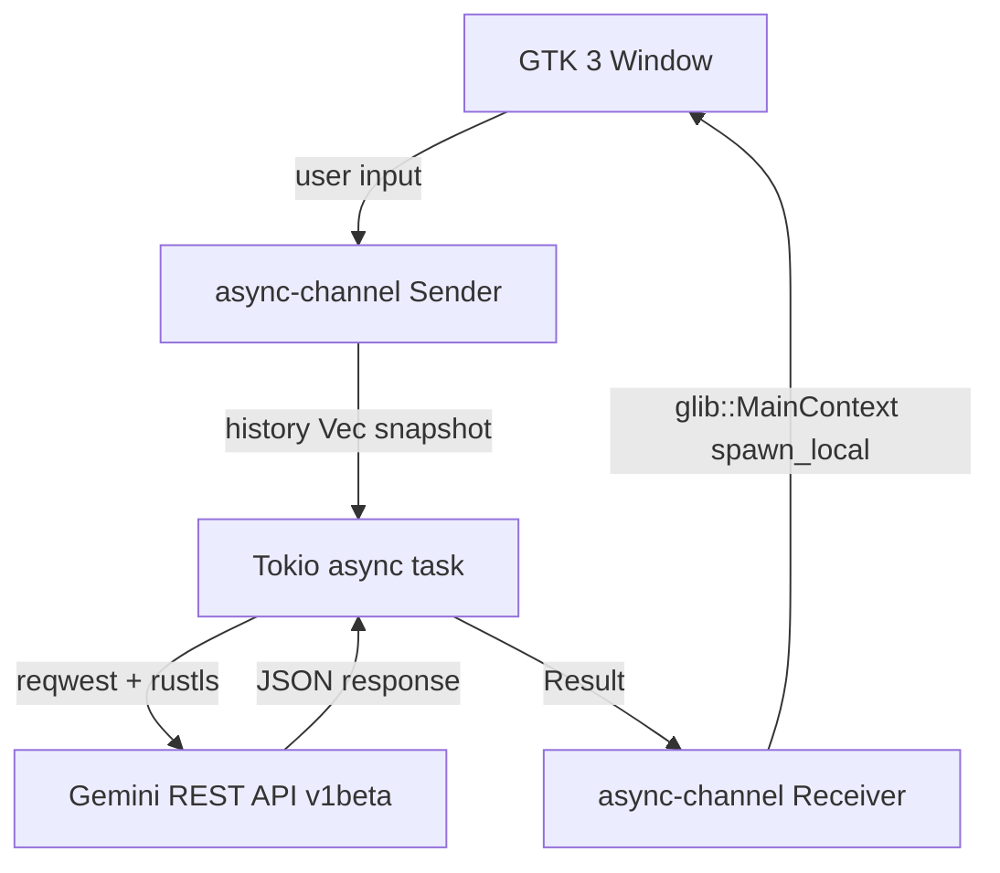

# Gemini Lite

[](https://github.com/chhaju/gemini-lite/actions)
[](https://www.rust-lang.org)
[](LICENSE)

I wanted to use Gemini without keeping a browser tab open. Chrome eats 500–800 MB just to render the page. Firefox isn't much better. This is a native Linux desktop app built in Rust and GTK 3 that talks directly to the Gemini API — idle memory sits around 15–30 MB.

---

## Why not just use the browser?

Honestly the UX is fine. The problem is the footprint. A Chrome tab with Gemini loaded pulls in a full rendering engine, a JavaScript runtime, GPU compositing layers — none of which you need to send a text prompt and read a response.

I started by wrapping `gemini.google.com` in a WebKitGTK window (basically a minimal browser). It worked locally but Google's WAF killed it in production: WebKitGTK has a distinct TLS fingerprint (different GREASE values and cipher ordering than Chrome/Safari) that Google's bot detection flags consistently, regardless of what User-Agent you spoof. Rather than pulling in Chromium Embedded Framework (~150 MB of deps) to fix the fingerprint, I scrapped the web wrapper entirely and called the REST API directly. Simpler, lighter, no more 502s.

---

## Features

- ~15–30 MB RAM idle (vs. 500–800 MB for Chrome, 200–400 MB for Firefox)
- Multi-turn conversations — full history sent with every request
- API key stored in GNOME Keyring on first run; plain-file fallback (`~/.config/gemini-lite/`, mode 0600) if no Secret Service daemon is present
- Dark theme via GTK system preference
- Window size/position remembered between sessions
- No OpenSSL dependency — TLS handled by `rustls`

## Architecture



GTK objects stay on the main thread. The HTTP layer runs in a Tokio runtime. `async_channel` is the only bridge between them.

---

## Installation

### Prerequisites

```bash
sudo apt-get install -y pkg-config libgtk-3-dev
```

No WebKit, no OpenSSL — those are the only native deps.

### Get a Gemini API key

1. Go to [https://aistudio.google.com](https://aistudio.google.com)
2. **Get API key** → **Create API key**
3. Copy it — the app will ask for it on first launch

### Build & install

```bash
git clone https://github.com/chhaju/gemini-lite
cd gemini-lite
make install
```

Binary goes to `~/.local/bin/gemini-lite`, desktop entry to `~/.local/share/applications/`.

### Run

```bash
gemini-lite
```

First launch shows an onboarding screen to paste your key. It gets saved to your system keyring automatically. After that, just launch and chat.

If you prefer the environment variable (handy for dev):

```bash
export GEMINI_API_KEY="AIza..."
gemini-lite
```

---

## Keyboard shortcuts

| Key | Action |
|-----|--------|
| `Enter` | Send message |
| `Ctrl+Q` | Quit |

---

## Development

```bash
make dev     # cargo run with RUST_LOG=debug
make build   # release build
make lint    # clippy + fmt check
make fmt     # auto-format
```

---

## License

MIT
