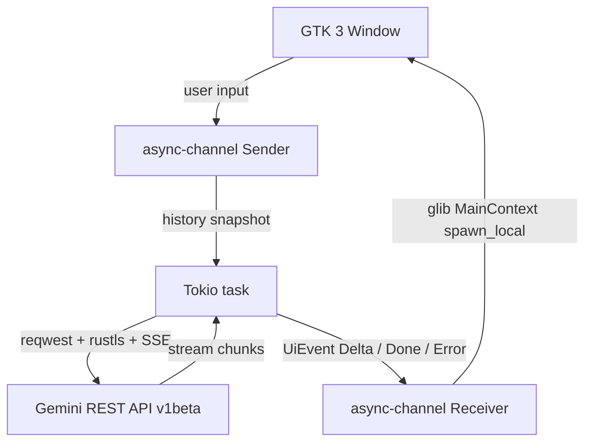

# Gemini Lite

<p align="center">
  
</p>

> A lightweight, native Linux client for Google Gemini. No Electron, no WebKit, just Rust.

[](https://github.com/Tormknd/gemini-lite/actions/workflows/ci.yml)
[](https://github.com/Tormknd/gemini-lite/releases)


Gemini Lite started from a simple frustration: asking text questions should not require a full browser engine and hundreds of MB of RAM. This app is a native GTK client in Rust that talks directly to the Gemini API.

---

## The Philosophy

Modern desktop software often accepts avoidable overhead as "normal". This project does not.

- **Efficiency by design:** native GTK 3 UI + Rust runtime, no embedded Chromium. GTK 3 was chosen over GTK 4 for stability and a smaller shared-library footprint on most stable distributions.
- **API-first architecture:** the app calls Gemini REST directly instead of wrapping `gemini.google.com`.
- **Pragmatic security:** API key in Secret Service (GNOME Keyring) when available, with a restricted file fallback.

Historical note: an early WebKitGTK wrapper worked locally but failed reliably behind Google's WAF due to TLS/client fingerprint differences. Switching to the official API removed that class of failures and simplified the stack.

---

## Benchmarks (Typical)

These numbers are measured on a local Linux workstation and should be treated as indicative, not absolute.

| Metric                  | Chrome + Gemini tab   | Gemini Lite             |
| ----------------------- | --------------------- | ----------------------- |
| **Idle RAM**            | 500–800 MB            | **15–30 MB**            |
| **Native dependencies** | Full web engine stack | **GTK 3 only**          |
| **TLS stack**           | Browser-managed       | **rustls (no OpenSSL)** |

---

## Features

- **Token efficiency:** Sliding window of the last 10 messages plus `Ctrl+K` to drop context; token count shown after each reply.
- **Model selector:** Switch between Flash and Pro-class models from the UI.
- **Multi-turn conversations:** Context balanced for coherence vs. API cost.
- **Streaming responses:** Server-Sent Events (`alt=sse`) with incremental UI updates.
- **Secure key storage:** GNOME Keyring when available, mode-`0600` file fallback under `~/.config/gemini-lite/`.
- **Native dark theme:** Follows the global GTK preference.
- **Persistent UI:** Window size and position saved between sessions.

---

## Project layout

Core logic is split into small crates under `src/` so networking and parsing stay testable without spinning up GTK:

| Module        | Role |
| ------------- | ---- |
| `api.rs`      | Gemini request/response types, `stream_gemini`, SSE assembly |
| `sse.rs`      | SSE event extraction, UTF-8-safe chunk buffering |
| `history.rs`  | Context pruning (sliding window, first role = user) |
| `config.rs`   | API key load/save, window state, XDG paths |
| `ui.rs`       | GTK windows, setup flow, chat view |
| `main.rs`     | Application entry: Tokio + `gtk::Application` |

Architecture decision records live in [`docs/architecture/`](docs/architecture/).

---

## Architecture



GTK stays on the main thread. HTTP runs in Tokio. `async-channel` bridges the two.

---

## Installation

### Recommended: install script (latest release)

From the default branch (replace `main` if your default branch differs):

```bash
curl -fsSL https://raw.githubusercontent.com/Tormknd/gemini-lite/main/install.sh | bash
```

The script resolves the **latest** GitHub release via the API. On **Debian/Ubuntu**, it installs the published `.deb` when available (dependencies via `apt`/`dpkg`). On other Linux distributions it downloads the `gemini-lite-linux-amd64` asset and installs the binary under `~/.local/bin` by default.

Optional environment variables:

| Variable | Purpose |
| -------- | ------- |
| `GEMINI_LITE_REPO` | `owner/name` repository (default: `Tormknd/gemini-lite`) |
| `GEMINI_LITE_INSTALL_DIR` | Binary install directory for non-deb path (default: `$HOME/.local/bin`) |
| `GEMINI_LITE_METHOD` | `auto` (default), `deb`, or `binary` |

`curl` and `python3` are required (Python is used only to parse the GitHub API JSON). For `.deb` installation as a non-root user, `sudo` is required.

### Manual: Debian package from Releases

1. Open the [Releases](https://github.com/Tormknd/gemini-lite/releases) page and download `gemini-lite_<version>_amd64.deb` for the version you want.
2. Install:

```bash
sudo apt-get install -y ./gemini-lite_<version>_amd64.deb
```

Or: `sudo dpkg -i gemini-lite_<version>_amd64.deb` then `sudo apt-get install -f` if dependencies need to be resolved.

### Verify downloads (SHA256)

Each release includes a `SHA256SUMS` file listing hashes for `gemini-lite-linux-amd64`, the `.deb`, and `gemini-lite-linux-amd64.tar.gz`. After downloading the files into the same directory:

```bash
sha256sum -c SHA256SUMS
```

### Build from source

**Build prerequisites:**

```bash
sudo apt-get install -y pkg-config libgtk-3-dev
```

**Get a Gemini API key**

1. Go to [https://aistudio.google.com](https://aistudio.google.com)
2. Click **Get API key** then **Create API key**
3. Keep it ready for first launch

**Clone and install (user prefix)**

```bash
git clone https://github.com/Tormknd/gemini-lite
cd gemini-lite
make install
```

Binary goes to `~/.local/bin/gemini-lite`, desktop entry and icon follow XDG locations under `~/.local/share/`.

### Run

```bash
gemini-lite
```

First launch asks for your API key. It is stored in your system keyring when available.

For local development, the environment variable still works:

```bash
export GEMINI_API_KEY="AIza..."
gemini-lite
```

---

## Screenshots

See `assets/screenshots/` for UI and memory-footprint captures.

---

## Keyboard shortcuts

| Key      | Action                    |
| -------- | ------------------------- |
| `Enter`  | Send message              |
| `Ctrl+K` | Clear context and history |
| `Ctrl+Q` | Quit                      |

---

## Development

```bash
make dev     # cargo run with RUST_LOG=debug
make build   # release build
make lint    # clippy -D warnings + cargo fmt --check
make fmt     # auto-format
cargo test   # unit tests + integration tests (wiremock SSE mocks, no network)
```

Continuous integration (GitHub Actions) runs **lint**, **tests**, **cargo-audit**, and a **release build** on pushes and pull requests to `main` / `dev`. Pushing a version tag matching `v*` (for example `v0.1.1`) triggers the **Release** workflow: optimized Linux amd64 binary, `.deb`, `.tar.gz`, `SHA256SUMS`, and GitHub release notes from commits since the previous tag. The value in `Cargo.toml` `[package].version` must match the tag without the leading `v`.

---

## License

MIT
