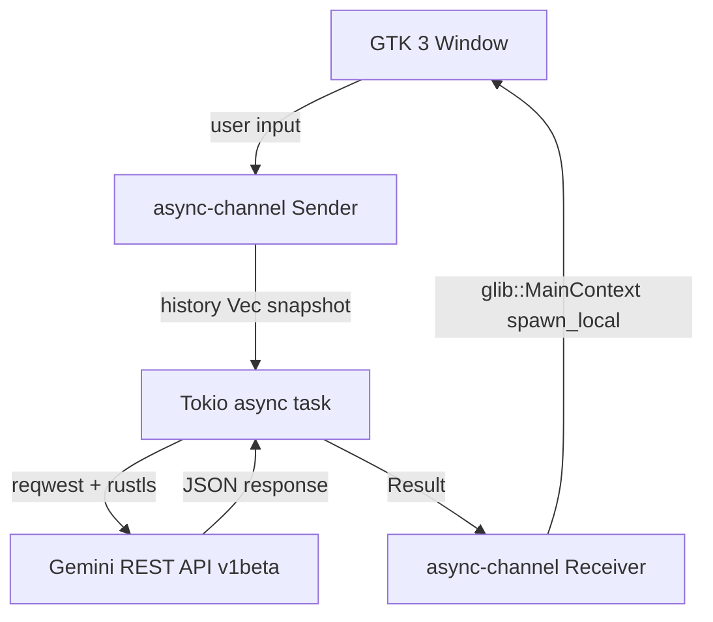

# Gemini Lite

[](https://github.com/chhaju/gemini-lite/actions)
[](https://www.rust-lang.org)
[](LICENSE)

A native Linux desktop client for Google Gemini. Written in Rust and GTK 3. No Electron. No Chromium. Idle memory footprint under 20 MB.

---

## Architectural Pivot & WAF Analysis

**v1** embedded Google's web interface via WebKitGTK. It worked locally but Google's WAF systematically blocked it in production with HTTP 502 errors caused by **TLS and JavaScript fingerprinting**: WebKitGTK exposes a distinct TLS ClientHello signature (GREASE values, cipher ordering) and a non-standard JS engine profile that Google's bot-detection infrastructure flags regardless of User-Agent spoofing.

Integrating Chromium Embedded Framework would have fixed the fingerprint but at the cost of adding ~150 MB of runtime dependencies — a non-starter for a project whose sole raison d'être is lightweight footprint.

The only viable path that respects the constraints: **drop the web wrapper entirely and speak directly to the official REST API.** The result is a native GTK application with zero browser overhead.

---

## Features

- **< 20 MB RAM** idle — no embedded browser engine
- Multi-turn conversation history sent with every request (full context window)
- Dark theme via GTK system preference
- Window size/position persisted across sessions (`~/.config/gemini-lite/`)
- API key stored in **GNOME Keyring** (Secret Service) on first run; falls back to a mode-0600 file under `~/.config/gemini-lite/` if no Secret Service daemon is available
- Built with `rustls` — no `libssl` / OpenSSL dependency

## Architecture



The GTK main loop and the HTTP layer never share state directly: `async_channel` bridges the two runtimes; GTK objects stay on the main thread at all times.

---

## Installation

### Prerequisites

```bash
sudo apt-get install -y pkg-config libgtk-3-dev
```

> No WebKit, no OpenSSL — those are the only native deps.

### Get a Gemini API key

1. Go to [https://aistudio.google.com](https://aistudio.google.com)
2. Click **Get API key** → **Create API key**
3. Copy the key

### Build & install

```bash
git clone https://github.com/chhaju/gemini-lite
cd gemini-lite
make install
```

The binary lands in `~/.local/bin/gemini-lite` and a `.desktop` entry is registered for your app launcher.

### First run

```bash
gemini-lite
```

On first launch with no key configured, the app shows an onboarding screen where you paste your key. It is saved automatically to your system keyring.

Alternatively, set the environment variable before launching (useful for dev):

```bash
export GEMINI_API_KEY="AIza..."
gemini-lite
```

---

## Keyboard shortcuts

| Key | Action |
|-----|--------|
| `Enter` | Send message |
| `Ctrl+Q` | Quit |

---

## Development

```bash
# Run with debug logs
make dev

# Release build
make build

# Lint (clippy + fmt check)
make lint

# Auto-format
make fmt
```

---

## License

MIT
